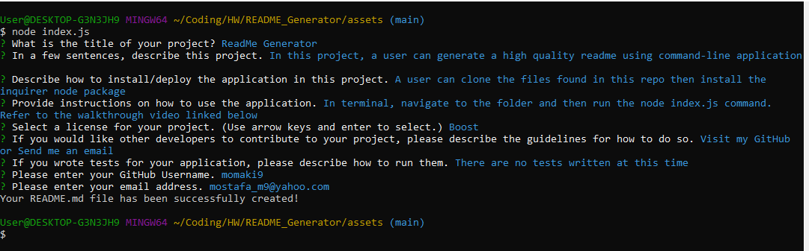

# Project Title: ReadMe Generator

## Project Description: In this project, a user can generate a high quality readme using command-line application
## 

## Table of Contents
  - [Installation](#installation)
  - [Usage](#usage)
  - [License](#license)
  - [Contributing](#contributing)
  - [Tests](#tests)
  - [Questions](#questions)

---
## Installation

A user can clone the files found in this repo then install the inquirer node package

## 

## Usage

In terminal, navigate to the folder and then run the node index.js command. Refer to the walkthrough video linked below

## 

## License

This application is covered under the Boost Software License 1.0

## Contributing

Visit my GitHub or Send me an email

## Tests

There are no tests written at this time

---
## Questions

If you have any questions, please visit my GitHub or send me an email.

[GitHub Link](https://github.com/momaki9)

[Email Me!](mailto:mostafa_m9@yahoo.com)
